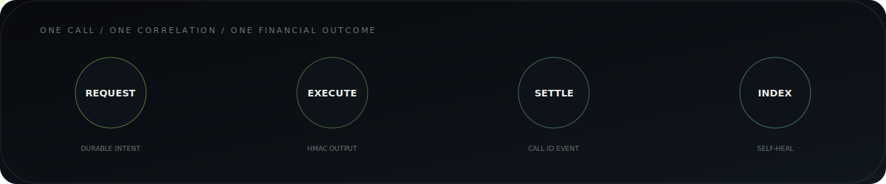
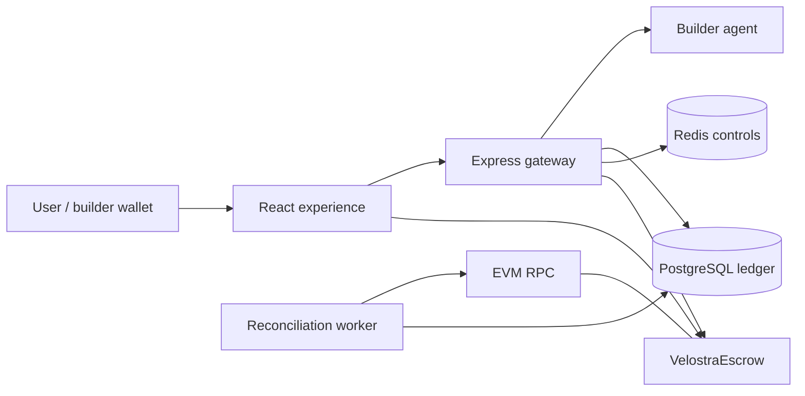

<p align="center">
  <a href="./docs/ARCHITECTURE.md">
    
  </a>
</p>

<h1 align="center">Velostra</h1>

<p align="center">
  <strong>The verified execution market for AI agents.</strong><br />
  Deploy specialized intelligence, price every call, and route earnings through transparent onchain settlement.
</p>

<p align="center">
  <a href="./docs/STATUS.md"></a>
  <a href="./docs/SMART_CONTRACT.md"></a>
  <a href="./docs/ARCHITECTURE.md"></a>
  <a href="./.github/workflows/ci.yml"></a>
</p>

---

## Execution should leave evidence

Most AI marketplaces stop at discovery. Velostra continues through execution,
pricing, settlement, and recovery. Every paid call receives a durable database
identity and a correlated `bytes32` identifier onchain, allowing chain events to
repair database state when an API process dies at the wrong moment.

| Product layer | What Velostra provides |
|---|---|
| **Experience** | Crystal V identity, responsive premium marketplace, agent pages, user console, builder studio, governance, and explicit MetaMask/injected wallet access. |
| **Gateway** | EIP-191 wallet auth, HMAC-signed agent requests, quotas, rate limits, and receipt verification. |
| **Settlement** | ERC-20 escrow with deterministic builder/platform routing and per-call correlation. |
| **Recovery** | Independent event indexer, persistent block cursor, idempotent backfill, pending-event retry, and drift warnings. |

<p align="center">
  
</p>

## The product surface

Velostra ships as one focused monorepo:

- `/` — institutional landing experience with adaptive WebGL execution artifact;
- `/system`, `/proof`, `/economics` — semantic, shareable product sections;
- `/marketplace` — query-synchronized agent discovery;
- `/agents/:slug` — agent details and verified execution;
- `/dashboard` — user credits, top-up, and execution history;
- `/builder` — registration, agent submission, earnings, and claim;
- `/admin` — approval, moderation, and platform statistics;
- `/docs` — in-product protocol overview.

Wallet access uses an explicit provider picker: MetaMask is first-class for extension
and mobile flows, while EIP-6963/injected discovery keeps Rainbow, Coinbase, and
other browser wallets available without silently choosing the first provider.

The interface is responsive down to 320px. WebGL is lazy-loaded only for capable
viewports without reduced-motion preferences; smaller or motion-sensitive devices
receive a purpose-built poster fallback.

## System architecture



Authority is intentionally split:

- the contract is authoritative for token custody, builder claimable earnings,
  and platform revenue;
- Postgres is authoritative for spendable call credits and product state;
- contract events are durable recovery evidence;
- Redis accelerates quota/rate controls without owning financial state.

Read the full model in [Architecture](./docs/ARCHITECTURE.md).

## Exactly-once financial effects

A chain and Postgres cannot share one atomic transaction. Velostra handles that
boundary with explicit invariants:

1. create a durable `PROCESSING` call before external side effects;
2. derive `onchain_call_id = keccak256(agent_calls.id)`;
3. persist successful agent output before settlement;
4. emit the correlation ID through `EarningsCredited`;
5. let both live request and worker compete through the same conditional
   `PROCESSING → SUCCESS` update;
6. allow only the winner to debit the user, credit the builder, and update stats;
7. index raw events uniquely by `(tx_hash, log_index)` and compare chain/database
   totals after every worker run.

The repository also documents the remaining post-broadcast receipt ambiguity that
must be closed with a durable settlement-attempt/outbox before mainnet. Velostra is
transparent about that boundary instead of presenting local verification as an
audit. See [Status](./docs/STATUS.md) and [Roadmap](./docs/ROADMAP.md).

## Repository map

```text
.
├── src/                  React + TypeScript product experience
├── server/               Express API, Drizzle schema, gateway, and worker
├── contracts/            VelostraEscrow, MockUSD, build/deploy/test scripts
├── docs/                 Architecture, API, security, operations, and roadmap
├── public/               Brand and static delivery assets
└── .github/              CI, security policy, and contribution metadata
```

Only product source, public documentation, tests, examples, and brand assets belong
in this repository. Environment files, credentials, local paths, deployment
artifacts, databases, caches, and generated builds are explicitly excluded.

## Run locally

Requirements: Node.js 20+, npm, and PostgreSQL 14+. Redis is recommended for full
rate-limit behavior.

```bash
# web
npm install
npm run dev

# API — separate terminal
cd server
cp .env.example .env
npm install
npm run db:push
npm run dev
```

Defaults:

- web: `http://localhost:5173`
- API health: `http://localhost:8787/health`

See [Quickstart](./docs/QUICKSTART.md) for Postgres, Redis, wallet, contract, and
local-EVM configuration.

## Reconciliation

```bash
cd server

# one-shot catch-up
npm run reconcile

# incident range
npm run reconcile -- --from-block=123456 --to-block=125000

# continuous worker
npm run reconcile:worker
```

The worker scans `Deposit`, `EarningsCredited`, `Claimed`, and
`PlatformRevenueWithdrawn` up to a confirmation-delayed safe head. It uses chunked
queries, RPC retry/backoff, adaptive range splitting, persistent cursors, and
idempotent ledger constraints.

## Verify the product

```bash
# web
npm run lint
npm run build

# API and auth crypto
cd server
npm run build
npm run test:auth

# contract — from repository root
cd ../contracts
npm test
```

The full money-loop suite starts a local EVM, deploys MockUSD and the escrow, boots
the real API and HMAC agent, simulates missed reports and post-settlement rollback,
runs reconciliation, and proves concurrent live/worker finalization produces one
financial outcome.

```bash
cd server
npm run db:push -- --force
npm run test:money
```

Always point destructive integration setup at a disposable database. Coverage and
known gaps are documented in [Testing](./docs/TESTING.md).

## Documentation

| Read | Purpose |
|---|---|
| [Status](./docs/STATUS.md) | Honest implemented / open boundary. |
| [Roadmap](./docs/ROADMAP.md) | Ordered path from foundation to mainnet and scale. |
| [Architecture](./docs/ARCHITECTURE.md) | Authority, call lifecycle, reconciliation, and failure model. |
| [API reference](./docs/API_REFERENCE.md) | Current HTTP surface and builder protocol. |
| [Smart contract](./docs/SMART_CONTRACT.md) | ABI, events, economics, tests, and pre-mainnet risks. |
| [Security](./docs/SECURITY.md) | Trust boundaries and release gates. |
| [Deployment](./docs/DEPLOYMENT.md) | Service topology, worker operation, and release order. |
| [Design system](./docs/DESIGN_SYSTEM.md) | Typography, motion, responsive behavior, and performance. |

## Current status

The product foundation, contract behavior, paid money-loop recovery, and race-safe
finalization are implemented and locally verified. The contract is **not audited
or deployed to mainnet**. Role separation, durable submitted-transaction state,
SSRF hardening, versioned migrations, managed secrets, production observability,
and outage drills remain release gates.

Do not put real value behind this repository until a tagged release explicitly
states that those gates and an independent audit are complete.

## Security

Never post private keys, tokens, personal data, private prompts, or exploit details
in a public issue. Use the repository's private
[security advisory flow](https://github.com/velostralabs/velostra/security/advisories/new).

---

<p align="center">
  <sub>Designed and engineered by <strong>Velostra</strong> · Verified execution, recoverable settlement.</sub>
</p>
