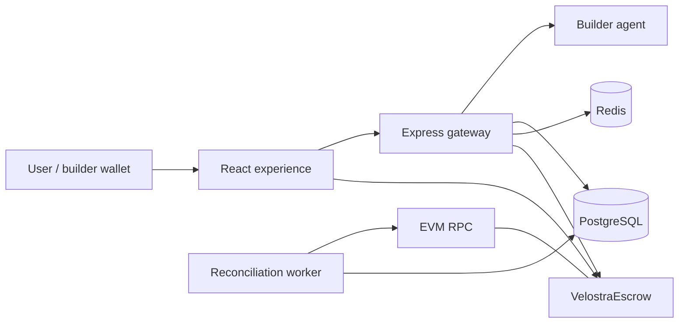

<p align="center">
  <a href="./docs/ARCHITECTURE.md">
    
  </a>
</p>

<h1 align="center">Velostra</h1>

<p align="center">
  <strong>The verified execution market for AI agents.</strong><br />
  Deploy specialized intelligence, price every call, and route earnings through recoverable onchain settlement.
</p>

<p align="center">
  <a href="./docs/STATUS.md"></a>
  <a href="./docs/SMART_CONTRACT.md"></a>
  <a href="./docs/ARCHITECTURE.md"></a>
  <a href="./.github/workflows/ci.yml"></a>
</p>

---

## Execution should leave evidence

Most AI marketplaces stop at discovery. Velostra continues through execution,
pricing, settlement, and recovery. Every paid call gets a durable database identity
and a correlated `bytes32` identifier onchain, so confirmed chain evidence can
repair the exact database row after process, RPC, or database failure.

| Product layer | What Velostra provides |
|---|---|
| **Experience** | Crystal V identity, premium marketplace, agent pages, user dashboard, builder and governance consoles, explicit MetaMask/injected wallet access. |
| **Gateway** | Bound EIP-191 auth, HMAC-signed agent requests, SSRF-safe egress, quotas, rate limits, and receipt verification. |
| **Settlement** | Role-separated 6-decimal ERC-20 escrow with collateral guards, deterministic fee routing, pause, rotation, and successor controls. |
| **Recovery** | Credit reservation, durable outbox, four-event indexer, persistent cursor, idempotent backfill, ambiguity recovery, and drift warnings. |

<p align="center">
  
</p>

## Product surface

- `/` - institutional landing experience with adaptive WebGL execution artifact;
- `/system`, `/proof`, `/economics` - semantic product sections;
- `/marketplace` - query-synchronized agent discovery;
- `/agents/:slug` - agent details and verified execution;
- `/dashboard` - credits, top-up, reservations, and call history;
- `/builder` - registration, agent submission, secret lifecycle, earnings, claim;
- `/admin` - RBAC moderation, roles, audit, and statistics;
- `/docs` - in-product protocol overview.

Wallet access always uses an explicit picker. MetaMask is first-class, while
EIP-6963/injected discovery keeps Rainbow, Coinbase, and compatible browser wallets
available without silently selecting a provider.

## Architecture



Authority is intentionally split:

- escrow owns token custody and onchain liabilities;
- Postgres owns spendable/reserved call credit and product state;
- confirmed events are durable recovery evidence;
- Redis owns no financial truth;
- governance, settler, treasury, and pause guardian are separate roles.

Read [Architecture](./docs/ARCHITECTURE.md) and the
[Threat model](./docs/THREAT_MODEL.md).

## Exactly-once financial effects

A chain and Postgres cannot share one transaction. Velostra uses explicit durable
states:

1. atomically create a `PROCESSING` call, reserve exact credit, and create a
   `PREPARED` settlement attempt;
2. call the builder without holding a database transaction;
3. persist the result and move the attempt to `READY`;
4. broadcast `creditBuilderEarnings(builder,gross,keccak256(call_id))`;
5. persist a returned hash before receipt polling, or keep a hashless
   `AMBIGUOUS` attempt when the broadcast response is lost;
6. let live path and worker compete through the same conditional
   `PROCESSING -> SUCCESS` transition;
7. allow only the winner to debit, credit, update stats, and insert the ledger;
8. reconcile raw events unique by `(tx_hash, log_index)` and report chain/DB drift.

The expanded local-EVM suite proves normal flow, missed deposit/claim reports,
post-chain DB rollback, receipt timeout, lost broadcast response, retroactive scan,
and concurrent live/worker finalization.

## Repository

```text
.
|-- src/                  React + TypeScript product experience
|-- server/               Express API, exact ledger, outbox, migrations, worker
|-- contracts/            VelostraEscrow, MockUSD, build/deploy/test scripts
|-- docs/                 Architecture, security, audit, operations, roadmap
|-- public/               Brand and static delivery assets
`-- .github/              CI and repository metadata
```

Only product source, public docs/tests/examples, and brand assets belong here.
Credentials, `.env`, local paths, dumps, deployment artifacts, caches, and generated
builds are excluded.

## Run locally

Requirements: Node.js 22+, npm, PostgreSQL 14+, and Redis 7 for the shared auth/
rate path.

```bash
# API
cp server/.env.example server/.env
npm install --prefix server
npm --prefix server run db:migrate
npm --prefix server run dev

# web - separate terminal
cp .env.example .env
npm install
npm run dev
```

Defaults: web `http://localhost:5173`, API health
`http://localhost:8787/health`. See [Quickstart](./docs/QUICKSTART.md).

## Reconciliation

```bash
npm --prefix server run reconcile
npm --prefix server run reconcile -- --from-block=123456 --to-block=125000
npm --prefix server run reconcile:worker
```

Normal scans advance a persistent confirmation-delayed cursor. Retroactive scans
are idempotent and cannot move that cursor over an unscanned gap. RPC ranges are
bounded, retried with backoff, and adaptively split.

## Verify

```bash
npm run lint
npm run build
npm run test:browser
npm run audit:metamask
npm run test:phase2-evidence

npm --prefix server run build
npm --prefix server run db:check
npm --prefix server run test:config
npm --prefix server run test:auth
npm --prefix server run test:ssrf
npm --prefix server run test:http-security
npm --prefix server run test:secrets
npm --prefix server run test:signer
npm --prefix server run test:authority
npm --prefix server run test:resilience
npm --prefix server run test:observability
npm --prefix server run test:admin-policy
npm --prefix server run test:money-unit

npm test --prefix contracts

# disposable migrated PostgreSQL
npm --prefix server run db:migrate
npm --prefix server run test:migrations
npm --prefix server run test:money
```

CI additionally performs production dependency audits, browser/accessibility/
performance verification, evidence-validator tamper tests, and PostgreSQL
dump/restore verification. See [Testing](./docs/TESTING.md).

Guarded Phase 2 staging runners are available only for an approved isolated
environment:

```bash
PHASE2_DRILL_APPROVED=isolated-staging-only \
PHASE2_BASE_URL=https://staging.example \
PHASE2_EXPECTED_ENVIRONMENT=staging-isolated \
PHASE2_SESSION_COOKIE='<synthetic-session-cookie>' \
PHASE2_AGENT_SLUG=<synthetic-agent> npm run phase2:load

PHASE2_SOAK_APPROVED=isolated-staging-72h \
PHASE2_BASE_URL=https://staging.example \
PHASE2_EXPECTED_ENVIRONMENT=staging-isolated \
PHASE2_METRICS_TOKEN='<managed-token>' \
PHASE2_SESSION_COOKIE='<synthetic-session-cookie>' \
PHASE2_AGENT_SLUG=<synthetic-agent> \
PHASE2_WORKER_RESTART_EVIDENCE_PATH=<restart.json> \
PHASE2_FINDINGS_EVIDENCE_PATH=<findings.json> npm run phase2:soak

npm run phase2:evidence -- --manifest=artifacts/phase2/evidence-manifest.json
```

The load and soak commands require their documented approval sentinels. The final
validator hashes every required artifact and fails closed if evidence is missing,
tampered, cross-release, or unsigned.

## Documentation

| Read | Purpose |
|---|---|
| [Phase 1 handoff](./docs/PHASE_1_HANDOFF.md) | Verified baseline, final review closures, evidence, and Phase 2 entry rules. |
| [Status](./docs/STATUS.md) | Implemented truth, evidence, and blockers. |
| [Roadmap](./docs/ROADMAP.md) | Phase completion and ordered next work. |
| [Architecture](./docs/ARCHITECTURE.md) | Authority, outbox, exactly-once flow, worker. |
| [Threat model](./docs/THREAT_MODEL.md) | Assets, threats, controls, residual risks. |
| [Audit readiness](./docs/AUDIT_READINESS.md) | External scope, frozen decisions, findings policy. |
| [Operations](./docs/OPERATIONS.md) | Incidents, catch-up, backups, secrets, successor. |
| [Smart contract](./docs/SMART_CONTRACT.md) | Roles, solvency, migration, ABI behavior. |
| [API](./docs/API_REFERENCE.md) | HTTP routes, RBAC, stable errors, HMAC. |
| [Security](./docs/SECURITY.md) | Implemented controls and release gates. |
| [Deployment](./docs/DEPLOYMENT.md) | Production topology and release order. |

## Status

Phase 1 implementation is recorded at the verified baseline in the
[Phase 1 handoff](./docs/PHASE_1_HANDOFF.md). Phase 2 repository implementation is
complete: isolated topology, restricted signer adapter, durable observability,
browser/wallet gates, RPC failover/finality policy, load/reorg/restore drills, and
the guarded soak/evidence pipeline are present and locally verified.
The contract is **not independently audited and not deployed to mainnet**. External
contract and focused backend review remain mandatory before Phase 3/mainnet. A real
managed-staging run—restricted signer custody, operator alert delivery, MetaMask,
load/outage/PITR evidence, and at least 72 hours of soak—remains an open Phase 2
exit gate.

Do not put real value behind this repository until a reviewed release explicitly
closes those gates.

## Security

Never post private keys, tokens, personal data, private prompts, or exploit details
in a public issue. Use GitHub's private security advisory flow for the repository.

---

<p align="center">
  <sub>Designed and engineered by <strong>Velostra</strong> &middot; Verified execution, recoverable settlement.</sub>
</p>
