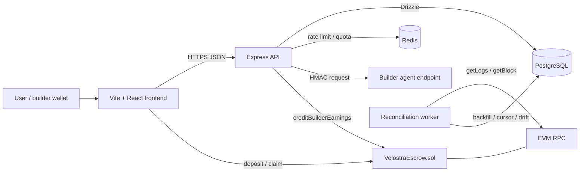

# Arsitektur Velostra

> Last verified against the workspace: 2026-07-15.

## System map



Frontend, API, worker, database, Redis, dan chain adalah deployment unit terpisah.
API dan worker memakai code/env backend yang sama, tetapi worker tidak dijalankan
di dalam process HTTP.

## Authority boundaries

Tidak ada satu datastore yang authoritative untuk semuanya:

| Domain | Authority |
|---|---|
| Token custody, builder claimable amount, platform revenue | `VelostraEscrow.sol` |
| User spendable call credit | `credit_balances` di Postgres |
| Agent/call metadata, reviews, moderation, product state | Postgres |
| Rate limit dan primary free-tier counter | Redis, dengan fallback Postgres untuk free tier |
| Reconstructable chain history | Contract event logs + `chain_events` |

`userCreditBalance` di contract saat ini adalah cumulative deposit counter. Ia
tidak berkurang saat paid call. Gateway hanya mengizinkan spending berdasarkan
Postgres ledger, sedangkan token tetap berada di escrow untuk membayar claim.
Inilah salah satu invariant yang harus difinalisasi sebelum mainnet.

## Frontend

Stack: React 19, Vite 8, TypeScript, React Router, TanStack Query, wagmi/viem,
`@metamask/connect-evm`, Framer Motion, Three.js, dan React Three Fiber.

Canonical routes:

| Route | Surface |
|---|---|
| `/`, `/system`, `/proof`, `/economics` | Landing dengan semantic section routing |
| `/marketplace` | Search/filter/sort agent; state tersimpan di query string |
| `/agents/:slug` | Agent detail dan execution |
| `/dashboard` | User balance, top-up, dan recent calls |
| `/builder` | Builder registration, submission, earnings, claim |
| `/admin` | Approval, reports, dan stats |
| `/docs` | In-product protocol page |

`RouteManager` mengubah legacy hashes seperti `/#proof` menjadi `/proof`, menjaga
scroll restoration, dan memperbarui document title. `/agent/:slug` redirect ke
`/agents/:slug`. Non-home pages di-lazy-load. Hero WebGL juga lazy dan hanya aktif
pada viewport minimum 821px tanpa reduced-motion; fallback poster dipakai di
perangkat lain.

Wallet connector layer didefinisikan di `src/lib/chain.ts`. MetaMask SDK connector
didaftarkan lebih dulu untuk extension/mobile flow, kemudian injected connector
menampung provider EIP-6963 seperti Rainbow atau Coinbase. `WalletButton` selalu
membuka explicit provider picker, mengurutkan dan mendeduplikasi connector, lalu
meminta Robinhood Chain `4663`; ia tidak lagi mengeksekusi provider pertama yang
diumumkan browser. Provider hanya mengusulkan account/signature/transaction—API
receipt verification dan contract tetap menjadi security boundary.

## Backend

Stack: Express 4, `express-async-errors`, Drizzle ORM, `pg`, `ioredis`, viem,
`jose`, dan Zod.

```text
server/src/
  db/                 schema dan Postgres client
  lib/auth.ts         nonce, EIP-191 verification, JWT
  lib/gateway/        HMAC, quota, rate limit, onchain client
  middleware/         auth dan role guards
  routes/             auth, agents, builder, dashboard, admin
  jobs/reconcile.ts   chain indexer, repair, drift report
  index.ts            Express wiring dan /health
```

Async route rejection diteruskan ke Express error middleware. Redis rate-limit
check bersifat fail-open agar outage Redis tidak mematikan seluruh platform;
trade-off abuse dari policy ini dicatat di `SECURITY.md`.

## Wallet authentication

1. User memilih MetaMask atau provider injected dari explicit picker.
2. Connector meminta account dan memastikan/switch ke target chain bila diperlukan.
3. Client meminta challenge lewat `POST /api/auth/nonce`.
4. Wallet menandatangani message EIP-191 tanpa gas setelah user approval.
5. Client mengirim wallet + signature ke `POST /api/auth/login`.
6. Server memverifikasi nonce yang belum dipakai dan belum kedaluwarsa.
7. Server membuat/memperbarui user dan mengirim JWT di httpOnly cookie.

Nonce saat ini berada di memory process. Karena itu auth belum aman untuk beberapa
instance API; Redis-backed atomic nonce consume adalah pekerjaan Phase 1.

## Normal paid-call flow

```mermaid
sequenceDiagram
    participant U as User
    participant A as API
    participant P as Postgres
    participant B as Builder endpoint
    participant C as Escrow
    participant W as Worker

    U->>A: POST /api/agents/:slug/run
    A->>P: INSERT agent_calls PROCESSING + onchain_call_id
    A->>P: BEGIN; lock credit balance
    A->>B: HMAC-signed input + call_id
    B-->>A: output
    A->>P: persist output outside final settlement transaction
    A->>C: creditBuilderEarnings(builder, gross, callId)
    C-->>A: confirmed EarningsCredited
    A->>P: conditional PROCESSING -> SUCCESS
    alt API wins conditional update
        A->>P: transaction + user debit + builder credit + agent stats
    else Worker already won
        A->>P: no financial side effects
    end
    A-->>U: output + settlement tx hash
    W->>C: later scans event logs
    W->>P: event already reconciled or no-op
```

`agent_calls` intent harus commit sebelum builder call atau chain broadcast. Untuk
paid call, `onchain_call_id = keccak256(agent_calls.id)`. Output upstream disimpan
sebelum settlement broadcast supaya recovery tidak kehilangan hasil agent.

Finalisasi live path dan worker memakai ownership claim atomik yang sama:

```sql
UPDATE agent_calls
SET status = 'SUCCESS', ...
WHERE id = ? AND status = 'PROCESSING'
RETURNING id;
```

Hanya transaksi yang menerima row dari `RETURNING` boleh mendebit user, mengkredit
builder, menambah statistik agent, atau membuat link settlement. Ini menutup race
ketika request hidup dan worker melihat event yang sama hampir bersamaan.

Backend signer writes diserialisasi oleh in-process promise queue untuk mengurangi
nonce collision di satu process. Multi-instance signer coordination belum ada dan
harus diuji sebelum horizontal scaling.

## Top-up dan claim

Top-up dan claim ditandatangani langsung oleh connected wallet yang sama:

1. frontend mengirim transaction ke contract dan menunggu receipt;
2. frontend melaporkan amount + `tx_hash` ke API;
3. API memverifikasi receipt status, destination escrow, sender, amount, dan event;
4. Postgres ledger di-update dengan unique hash.

Jika API mati sebelum langkah 2/4, event tetap ada di chain dan worker akan
backfill tanpa laporan ulang user.

## Reconciliation worker

`server/src/jobs/reconcile.ts` memproses event sebagai berikut:

1. identifikasi deployment dengan `chain_id + contract_address`;
2. buat/baca `chain_sync_state.last_processed_block`;
3. tentukan `safeHead = latestBlock - RECONCILE_CONFIRMATIONS`;
4. scan mulai cursor berikutnya dalam chunk `RECONCILE_MAX_BLOCK_RANGE`;
5. decode empat event dan ambil timestamp block;
6. insert raw event dengan unique `(tx_hash, log_index)`;
7. apply event di transaction Postgres;
8. update cursor setelah range tersimpan;
9. retry pending event sebelum dan sesudah scan;
10. bandingkan totals dan log `DRIFT WARNING` bila threshold terlewati.

Event application:

- `Deposit`: buat `TOPUP` transaction dan tambah user credit.
- `Claimed`: buat `earnings_claims`, kurangi available, tambah total claimed.
- `EarningsCredited`: cari exact `agent_calls.onchain_call_id`, conditional finalize,
  buat `AGENT_CALL` transaction, debit user, credit builder, update agent stats.
- `PlatformRevenueWithdrawn`: buat `PLATFORM_WITHDRAWAL` transaction.

Unknown user/builder/call tidak dibuang; event disimpan sebagai unreconciled dengan
error dan dicoba lagi. Cursor tetap dapat maju karena raw event sudah durable.

### Idempotency dan concurrency

- raw event: unique `(tx_hash, log_index)`;
- top-up/settlement transaction: unique `transactions.tx_hash`;
- claim: unique `earnings_claims.tx_hash`;
- paid-call correlation: unique `agent_calls.onchain_call_id`;
- satu settlement link per call: unique `transactions.agent_call_id`;
- financial side effects: conditional finalization winner only.

Overlapping scan range aman dari duplicate ledger effect. Namun belum ada
distributed worker lease. Production awal sebaiknya menjalankan satu continuous
worker yang disupervisi. Manual `--from-block` yang lebih tinggi dari cursor dapat
memajukan cursor melewati gap yang sengaja dilewati; gunakan retroactive scan
untuk incident range yang diketahui dan jangan menggunakannya sebagai pengganti
normal catch-up tanpa memeriksa cursor.

### Catch-up setelah outage satu jam

Worker dapat catch up karena cursor persistent dan range diproses berurutan. Dengan
asumsi target block interval 100 ms yang ditampilkan produk, satu jam adalah kira-
kira 36.000 block; default chunk 2.000 berarti sekitar 18 `getLogs` range, ditambah
`getBlock` hanya untuk block yang berisi event Velostra.

Proteksi RPC yang sudah ada:

- per-call timeout dari `ROBINHOOD_RPC_TIMEOUT_MS`;
- exponential retry dari `RECONCILE_RPC_RETRIES` dan base delay;
- adaptive range splitting untuk timeout/response-size/range-limit error;
- 429 tidak di-split berulang; watch loop log error, menunggu interval, lalu resume
  dari cursor yang belum maju.

Jadi tidak ada data yang sengaja dilewati, tetapi tidak ada jaminan waktu catch-up
jika provider terus throttle/down atau event density sangat tinggi. Production
harus memakai dedicated RPC, metric cursor lag, pending-event age, RPC 429/error,
dan alert drift. One-hour outage drill adalah exit gate Phase 2.

## Failure model

| Failure | Hasil |
|---|---|
| API crash sebelum durable intent | Tidak ada onchain paid settlement yang seharusnya dibroadcast. |
| Builder endpoint gagal sebelum settlement | Call conditional menjadi FAILED; tidak ada charge. |
| Chain write definitif gagal sebelum broadcast/revert | Final DB ledger tidak dijalankan; response 502. |
| Chain sukses, final DB commit gagal | Response 503 `reconciliation_pending`; worker memperbaiki exact call. |
| Top-up/claim sukses, API tidak dipanggil | Worker backfill dari event. |
| Worker mati | Cursor tidak bergerak; restart melanjutkan catch-up. |
| Redis mati | Rate limit fail-open; free-tier memakai fallback Postgres. |
| Unknown wallet/call saat event muncul | Raw event pending dan di-retry. |

### Recovery boundary yang masih terbuka

Current reconciliation menutup crash atau DB rollback setelah confirmed event saat
call masih `PROCESSING`. Ada satu ambiguity window yang belum ditutup: signer helper
baru mengembalikan tx hash setelah `waitForTransactionReceipt` berhasil. Jika
`writeContract` sudah broadcast tetapi receipt wait/RPC kemudian error sementara
process masih hidup, outer path belum memiliki hash dan dapat mengubah call menjadi
`FAILED`. Bila transaction itu kemudian confirmed, worker melihat event tetapi
conditional guard hanya menerima `PROCESSING`.

Phase 1 harus menambah durable settlement-attempt/outbox: simpan hash langsung
setelah broadcast, bedakan definitive failure dari unknown/ambiguous submission,
pertahankan recoverable state, dan buktikan worker tetap exactly-once saat receipt
muncul belakangan. Paid path juga perlu reservation state machine agar tidak
menahan long DB transaction selama builder HTTP dan chain wait.

## Keputusan arsitektur yang masih terbuka

- Pisahkan backend settlement role dari owner/treasury multisig.
- Finalisasi escrow solvency dan makna onchain user credit.
- Multi-instance signer nonce coordination dan distributed worker ownership.
- Exact decimal strategy tanpa JS number untuk financial decisions.
- Production migrations, secrets encryption, observability, dan RPC failover.

Urutan penyelesaiannya ada di [ROADMAP.md](./ROADMAP.md).
