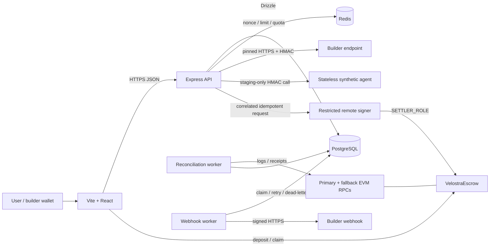

# Arsitektur Velostra

> Architecture truth refreshed 2026-07-22 against the live bounded public testnet,
> correlated settlement implementation, recovery workers, and mainnet-isolation gate.
> Phase state: Phase 0-4 repository preparation is complete and has passed internal
> engineering/CI audit; continued development is clear. Managed-staging evidence
> remains a mainnet release prerequisite.

## System map



Frontend, API, reconciliation worker, webhook worker, Postgres, Redis, RPC, and
contract are separate failure domains. Backend roles use the same immutable build but
run as separate supervised processes.

Current deployment overlay (2026-07-20): the canonical Vite/React frontend is
public on Netlify and connected to the managed US testnet API, verified synthetic
token, and escrow. The private signer, reconciliation/webhook/monitor jobs, Scheduler
triggers, Neon Postgres, Upstash Redis, primary/fallback RPC, three Safe authorities,
and stateless synthetic agent are live in the approved US chain-46630 environment.
Deep readiness is 8/8 and bounded synthetic paid writes are enabled.

## US-only staging runtime

The low-cost managed translation preserves those failure domains in Virginia:

- the public Netlify frontend remains a separate browser/CDN failure domain and
  reaches only the exact allowlisted API origin; it has no backend or signer authority;
- the deployed staging velostra-web and velostra-api Cloud Run services scale from
  zero to at most two instances;
- the staging-only synthetic-agent service scales from zero to one instance under
  the unprivileged web identity; it has no secret, database, or Redis access and
  persists or echoes no request input;
- the next-RC catalog routes one retained release-evidence profile plus four public
  demo profiles through explicit path-to-profile lookup; unknown paths fail with 404,
  and every response declares deterministic public-testnet proof and non-retention;
- database discovery remains authoritative: a release-bound one-shot seed creates or
  strictly verifies the builder, agent, tags, and immutable published revision before
  a profile may be exposed as runnable;
- the browser scenario query prefills a documented prompt but never invokes the run
  endpoint automatically, so navigation alone cannot debit a user or credit a builder;
- private velostra-signer scales from zero to one instance and runs a dedicated
  signer entrypoint under its own identity;
- reconciliation, webhook delivery, monitoring, and migration are separate one-task
  Cloud Run Jobs;
- Scheduler invokes only the three recurring jobs at staggered 15-minute intervals;
- public mode is fail-closed behind immutable-release, signer-funding, readiness, and
  bounded per-call/per-wallet/global/top-up policy;
- the API and jobs may invoke the private signer, while the web identity has no
  backend or signer authority;
- a dedicated build identity can read regional build source, write Cloud Logging,
  and push only to the Velostra Artifact Registry repository; it has no runtime,
  signer, database, or secret authority;
- Neon Postgres uses aws-us-east-1, Upstash uses GCP us-east4, and every GCP resource
  is locked to us-east4;
- staging chain identity is Robinhood testnet 46630; mainnet 4663 is not accepted by
  this deployment policy.

The same immutable server image supplies API, signer, and job code, but command
overrides select the exact role. Secret Manager grants are per service identity.
The signer alone receives Cloud KMS signerVerifier on the managed secp256k1 key.

## Authority boundaries

| Domain | Authority |
|---|---|
| Token custody, builder liabilities, platform revenue | `VelostraEscrow.sol` |
| User spendable and reserved call credit | Postgres `credit_balances` |
| Call, revision, webhook, moderation, privacy, and telemetry state | Postgres |
| Chain recovery evidence | confirmed contract logs + `chain_events` |
| Wallet identity | verified EIP-191 signature over a bound challenge |
| Rate limits / fast quota | Redis; never financial truth |

`userCreditBalance` onchain is intentionally cumulative deposit evidence. It never
decreases and must never be presented as spendable balance. Postgres is the sole
spendable-credit ledger; escrow liquidity collateralizes settlement liabilities.

## Contract authority

`VelostraEscrow` uses delayed role-based administration:

- `DEFAULT_ADMIN_ROLE`: governance multisig; two-day admin-transfer delay; unpause
  and successor declaration;
- `SETTLER_ROLE`: backend hot path; only correlated earnings credit;
- `TREASURY_ROLE`: platform revenue withdrawal and successor liquidity migration;
- `PAUSER_ROLE`: emergency pause only;
- `FEE_MANAGER_ROLE`: fee update under a 50% hard cap.

The guarded testnet deploy path requires three distinct canonical Safe 1.4.1
accounts for governance, treasury, and pause authority. Each must have exactly three
owners, threshold two, and an owner set disjoint from every other authority. The
restricted KMS settler must remain a separate EOA. Live owner/threshold/version/code
checks run before escrow deployment and again during verification. Claims remain
available while paused. A declared successor permanently closes new deposits and
settlements; only liquidity above all outstanding liabilities can migrate.

## Backend trust boundary

- Auth challenges are domain/URI/chain/time bound and stored in Redis.
- Atomic Redis compare-and-delete gives exactly one login winner across instances.
- Production cookies are httpOnly and secure with `SameSite=None` so the isolated
  HTTPS web origin can authenticate to the separately hosted API; exact-origin CORS
  rejects every non-allowlisted browser origin. Local/test cookies remain
  `SameSite=Lax` without the production-only secure flag.
- Builder endpoints pass scheme/port policy, DNS resolution, blocked-address checks,
  pinned connection, redirect revalidation, timeout, and response-size limits.
- Per-agent HMAC secrets are AES-256-GCM envelopes with a key ID; plaintext rows
  block production startup.
- Admin permissions come from database RBAC; each mutation writes an audit record.
- Production configuration fails closed for unsafe DB/Redis/origin/auth/secret/
  signer/chain/contract settings; raw signer keys are rejected.
- The API submits through one restricted remote signer; public reads and recovery use
  ordered primary/fallback RPC transports.
- /api/v1 adds signed cursor scope, stable envelopes, and durable actor/operation/
  fingerprint-bound idempotency; compatible legacy routes advertise migration headers.
- Published agent revisions are immutable and every call records its executed revision.
- Webhook secrets are one-time plaintext; exact bodies are HMAC signed and delivery
  attempts are durable.
- Moderation/privacy/telemetry actions are classified, permissioned, and audited.

## Browser session and recovery boundary

Protected React surfaces derive authorization from both the server session and the
currently connected wallet. A session is rendered only when its normalized
`wallet_address` matches the active account and the account is on the configured
Robinhood chain. Account/chain events therefore replace protected content with a
verification/network gate before another wallet can observe it. One successful login
broadcasts a local auth-change signal so every gate on the same page refreshes from
the authoritative httpOnly session.

A paid-call request creates one idempotency key. If the API returns
`reconciliation_pending`, the browser retains the supplied `call_id` and optional
transaction hash; it never sends the work again. It polls
`GET /api/v1/dashboard/calls/:callId`, whose database predicate includes both call
ID and authenticated user ID. Non-owners receive the same 404 as a missing call.
Only a terminal SUCCESS response exposes output. PROCESSING remains pending, while a
definitive FAILED state permits a new user decision. Dashboard history refreshes
while any owned call is PROCESSING.

Public runtime truth is two-level: `/health` proves expected staging/chain/public
mode, while `/ready` proves dependency and worker freshness. The browser displays
`TESTNET LIVE` only when both pass; otherwise it reports read-only, degraded, or
unavailable without implying recovery is active.

## Paid-call lifecycle

```mermaid
sequenceDiagram
    participant U as User
    participant A as API
    participant P as Postgres
    participant B as Builder
    participant C as Escrow
    participant W as Worker

    U->>A: POST /api/agents/:slug/run
    A->>P: transaction: PROCESSING call + reserve credit + PREPARED outbox
    A->>B: HMAC input + call_id
    B-->>A: result
    A->>P: persist result; PREPARED -> READY
    A->>C: creditBuilderEarnings(builder,gross,keccak256(call_id))
    A->>P: persist hash; READY -> SUBMITTED
    A->>C: wait for receipt
    A->>P: SUBMITTED -> CONFIRMED
    A->>P: conditional PROCESSING -> SUCCESS + ledger effects
    W->>C: scan confirmed EarningsCredited
    W->>P: same conditional finalize or guarded no-op
```

No SQL transaction is open during builder HTTP or chain receipt waiting. The
initial transaction atomically creates the call, reserves exact credit, and creates
the outbox row. Builder output is durable before any chain write.

Outbox states:

```text
PREPARED -> READY -> SUBMITTED -> CONFIRMED -> APPLIED
    |         |          |
    +------> FAILED      +------> AMBIGUOUS -> CONFIRMED/APPLIED
                 unknown broadcast outcome ----^
```

A definitive upstream or pre-broadcast failure conditionally marks the call failed
and releases the reservation. Receipt/broadcast uncertainty stays recoverable and
keeps the reservation.

## Exactly-once finalization

Both live and worker paths call `finalizeSettlement`. It claims ownership with:

```sql
UPDATE agent_calls
SET status = 'SUCCESS', ...
WHERE id = $1 AND status = 'PROCESSING'
RETURNING id;
```

Only the transaction receiving a returned row may:

- subtract `balance_usd` and `reserved_usd`;
- add builder `available` and `total_earned`;
- increment agent calls/revenue;
- insert the settlement ledger row;
- move the outbox to `APPLIED`.

A losing path accepts an already-`SUCCESS` row and performs a guarded no-op. This
race is exercised by concurrent live-request/worker E2E.

## Broadcast and receipt ambiguity

- The live path persists a returned tx hash before receipt polling.
- If receipt lookup fails, the attempt becomes `AMBIGUOUS`; worker polls it and/or
  consumes the correlated event.
- If the RPC accepted a transaction but its response disappeared before the hash
  reached Postgres, the attempt remains hashless and reserved. A confirmed
  `EarningsCredited.callId` locates the exact call and applies the authoritative
  event hash.
- A recovery rebroadcast and original transaction cannot both succeed because the
  contract rejects reused call IDs. If the candidate hash differs, the exact
  correlated successful event may replace it after builder and amounts match.
- The builder/platform split decoded from the confirmed EarningsCredited event is
  authoritative. It replaces the anticipated split in the outbox before financial
  effects, so an authorized contract fee update cannot desynchronize Postgres.

## Top-up and claim

Users submit deposit/claim transactions from their own wallet. The API verifies
receipt success, contract destination, authenticated sender, exact event, exact
amount, and replay uniqueness. If the browser never reports the hash, the worker
backfills directly from `Deposit` or `Claimed`.

## Reconciliation worker

Each run:

1. loads the deployment-specific cursor;
2. computes `safeHead = latest - confirmations`;
3. retries pending raw events;
4. scans contiguous chunks with RPC retry and adaptive split;
5. stores events unique by `(tx_hash, log_index)` and block timestamp;
6. applies Deposit, EarningsCredited, Claimed, and PlatformRevenueWithdrawn;
7. advances the cursor only for a scan starting at the exact next block;
8. retries pending events and nonterminal outbox attempts;
9. compares chain totals with Postgres and logs drift.

A retroactive `--from-block` range that does not start at the next cursor is
idempotent and explicitly preserves the normal cursor. Unknown users/builders/calls
remain durable pending events instead of disappearing.

## One-hour catch-up

The worker resumes from its cursor, so a one-hour outage is a backlog, not data
loss. Default 2,000-block chunks, per-RPC timeout, ordered endpoint failover,
exponential retry, adaptive splitting, and range-level cursor commits bound each step.
Sustained failure across every endpoint can extend catch-up indefinitely; it cannot
skip failed work. Local catch-up/failover invariants pass. The managed reconciliation
schedule was paused beyond one hour and caught up to its recorded safe head in 7,225
ms with zero duplicates, pending work, skipped range, or drift. This validates worker
recovery, not a destructive API/Postgres/Redis outage.

The cost-bounded staging cadence can add up to 15 minutes before a scheduled repair
starts, so readiness and stale-worker alerts use a 20-minute maximum age. Once a job
starts, it still catches up through bounded contiguous ranges. This cadence is a
staging cost choice, not the future production recovery SLO.

The API samples outbox, cursor, event, webhook, and heartbeat state sequentially.
This deliberately keeps each observability sweep at one database read at a time,
matching the small production pool and preventing the readiness probe from creating
its own connection-pressure failure during worker completion.

## Phase 3 release control plane

```mermaid
flowchart LR
    FREEZE["Commit + bytecode + audit + custody + operations"] --> PACKET["Plan-only readiness packet"]
    PACKET -->|"READY_FOR_SIGNING only"| INPUT["Reviewed input + evidence"]
    PACKET -->|"NO_GO"| BLOCK["Close external blockers"]
    INPUT --> MANIFEST["Immutable release manifest"]
    MANIFEST --> PLAN["Inert deployment plan"]
    PLAN --> BROADCAST["Explicit guarded broadcast"]
    BROADCAST --> VERIFY["Deployed manifest + verification"]
    VERIFY --> READY["Operational GO / NO-GO"]
    READY --> MODE["Paid writes disabled / canary"]
    MODE --> ADMIT["Serialized Postgres admission"]
    ADMIT --> SETTLE["Existing exactly-once settlement"]
    SETTLE --> SUMMARY["Automatic canary summary"]
    SUMMARY --> STOP["STOP + forward repair"]
    SUMMARY --> PASS["PASS_AWAITING_OPERATOR"]
```



The mainnet readiness packet precedes the release manifest. It independently
hash-binds the commit, contract source/bytecode, lockfiles, audit evidence,
production authority/custody and recovery state, write-closed deployment/rollback,
and disabled low-value canary policy. Its preparation schema makes broadcast,
canary, and expansion authorization permanently false. `READY_FOR_SIGNING` only
permits the separate two-person signing workflow; `NO_GO` keeps the release lane
closed.

The manifest is a separate release authority boundary. It binds the clean full
commit, reproducible contract output, migration graph, lockfiles, policies, external
evidence, images, roles, chain, and approvals. Preparation cannot be used as a
broadcast manifest; broadcast-approved cannot masquerade as deployed.

Mainnet-like API/reconciliation/webhook/monitor startup validates the exact deployed manifest.
Paid-call mode defaults to `disabled`. In `canary` mode the API checks immutable
allowlists/window/per-call caps, then acquires a transaction-scoped advisory lock.
Within that same transaction it rechecks global and wallet exposure, inserts
`release_canary_admissions`, reserves funds, and creates the outbox. This makes the
cap linearizable under concurrent requests. Free calls, builder claims, and
reconciliation are outside the paid-write stop boundary.

Settlement changes admission status only inside the existing conditional
`PROCESSING -> SUCCESS` winner transaction (or conditional failure transaction).
The collector derives the canary summary from the admission/event/heartbeat ledgers
and final readiness snapshot. Failure produces a forward-repair stop plan that
disables new paid risk while preserving claims and reconciliation. A passing result
still requires a separate operator approval before public mode.

## Phase 4 platform control plane

~~~mermaid
flowchart LR
    CLIENT["SDK / console"] --> V1["Versioned API"]
    V1 --> IDEM["Durable idempotency"]
    V1 --> REV["Immutable revisions"]
    V1 --> TRUST["Moderation / privacy / telemetry"]
    REV --> EVENT["Stable webhook event"]
    TRUST --> EVENT
    EVENT --> DELIVERY["Delivery + attempt ledger"]
    DELIVERY --> WH["Webhook worker"]
    WH --> ENDPOINT["Builder HTTPS receiver"]
    DELIVERY --> DLQ["Dead letter + audited replay"]
~~~

New externally retried mutations first claim an idempotency identity. A completed
request replays its exact stored response; a conflicting fingerprint is rejected.
An expired PROCESSING state is indeterminate because the business commit may already
exist, so it fails closed instead of stealing ownership and duplicating effects.

Revision numbering and activation are serialized per agent. Published rows are never
edited; activation copies the selected snapshot and sends the listing back through
approval. Notifications and webhook events are created in the same database
transaction as their business transition.

Webhook events have stable dedupe identities. One event fans out to unique
subscription deliveries. Workers claim due rows conditionally, hold a bounded lock,
sign exact body bytes, record every attempt, and either deliver, reschedule with
bounded backoff, or dead-letter. RBAC/audited replay resets only a dead-letter row.
Readiness and alerts track worker heartbeat and oldest pending delivery.

The staging operational monitor sends alerts directly from its us-east4 job to a
private Telegram channel. Bot token and channel ID are injected from separate
Secret Manager values. Telegram messages omit parsing modes, bound their size,
redact sensitive detail keys, and replace transport failures with credential-free
errors before Cloud Logging receives them.

Privacy deletion anonymizes personal product fields while preserving the minimum
financial, settlement, security, and audit evidence required for integrity.
Telemetry collection fails closed unless a field is classified, owned, retained for
a bounded period, and enabled; prohibited fields cannot be enabled.

## Failure model

| Failure | Result |
|---|---|
| Crash before durable intent | no chain settlement should have been submitted |
| Builder failure | conditional failure; reservation released; no charge |
| Chain revert with known sole tx | call fails; reservation released |
| Receipt timeout | AMBIGUOUS; worker recovers or keeps reserved |
| Broadcast accepted, response lost | correlated event recovers exact call/hash |
| Chain success, DB commit fails | CONFIRMED/AMBIGUOUS outbox and event repair it |
| Top-up/claim report missing | event backfill |
| Live path and worker race | one winner, one no-op |
| Worker outage | cursor unchanged; restart catches up |
| Redis outage in production | auth/abuse-sensitive operation fails closed |
| RPC rate limit | ordered endpoint failover, retry/backoff, then same cursor |
| Duplicate API retry | one durable idempotency owner; replay/conflict/indeterminate response |
| Webhook endpoint outage | durable attempts, bounded retry, dead letter, audited replay |
| Concurrent webhook workers | one conditional claim; expired lock is recoverable |

## Current scaling boundary

Initial production design is one supervised reconciliation worker, one supervised
webhook worker, and one logical restricted signer writer. DB/event idempotency tolerates overlap; multi-RPC failover, confirmation-depth
reorg handling, concurrent load, dense catch-up, and tamper-evident release tooling are
implemented. Distributed worker leases, multi-writer nonce coordination, and a rollback
engine for reorgs deeper than the confirmation window remain later scale work. See
[THREAT_MODEL.md](./THREAT_MODEL.md) and [OPERATIONS.md](./OPERATIONS.md).
