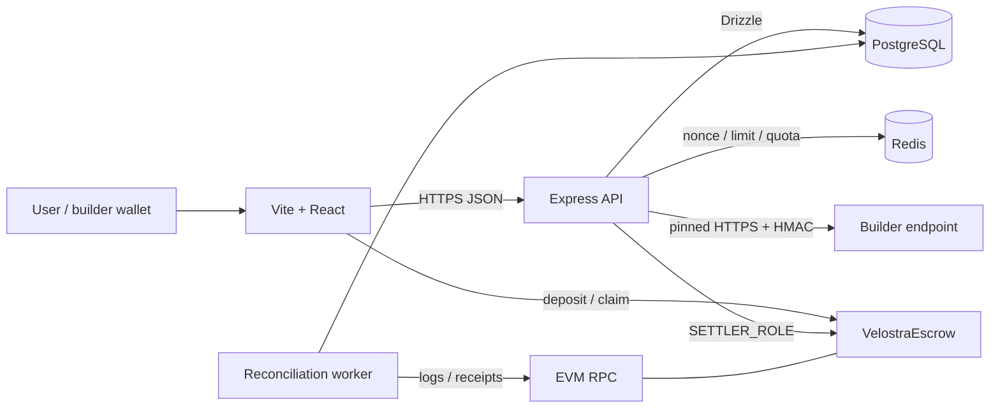

# Arsitektur Velostra

> Last verified against the workspace: 2026-07-15.

## System map



Frontend, API, worker, Postgres, Redis, RPC, and contract are separate failure
domains. The API and worker use the same backend build but run as separate
supervised processes.

## Authority boundaries

| Domain | Authority |
|---|---|
| Token custody, builder liabilities, platform revenue | `VelostraEscrow.sol` |
| User spendable and reserved call credit | Postgres `credit_balances` |
| Call/product/moderation state | Postgres |
| Chain recovery evidence | confirmed contract logs + `chain_events` |
| Wallet identity | verified EIP-191 signature over a bound challenge |
| Rate limits / fast quota | Redis; never financial truth |

`userCreditBalance` onchain is intentionally cumulative deposit evidence. It never
decreases and must never be presented as spendable balance. Postgres is the sole
spendable-credit ledger; escrow liquidity collateralizes settlement liabilities.

## Contract authority

`VelostraEscrow` uses delayed role-based administration:

- `DEFAULT_ADMIN_ROLE`: governance multisig; two-day admin-transfer delay; unpause
  and successor declaration;
- `SETTLER_ROLE`: backend hot path; only correlated earnings credit;
- `TREASURY_ROLE`: platform revenue withdrawal and successor liquidity migration;
- `PAUSER_ROLE`: emergency pause only;
- `FEE_MANAGER_ROLE`: fee update under a 50% hard cap.

The deploy script requires four distinct role addresses and verifies that admin is
a deployed contract. Claims remain available while paused. A declared successor
permanently closes new deposits/settlements; only liquidity above all outstanding
liabilities can migrate.

## Backend trust boundary

- Auth challenges are domain/URI/chain/time bound and stored in Redis.
- Atomic Redis compare-and-delete gives exactly one login winner across instances.
- Production cookies are httpOnly, secure, same-site; CORS uses exact HTTPS origins.
- Builder endpoints pass scheme/port policy, DNS resolution, blocked-address checks,
  pinned connection, redirect revalidation, timeout, and response-size limits.
- Per-agent HMAC secrets are AES-256-GCM envelopes with a key ID; plaintext rows
  block production startup.
- Admin permissions come from database RBAC; each mutation writes an audit record.
- Production configuration fails closed for unsafe DB/Redis/origin/auth/secret/
  signer/chain/contract settings.

## Paid-call lifecycle

```mermaid
sequenceDiagram
    participant U as User
    participant A as API
    participant P as Postgres
    participant B as Builder
    participant C as Escrow
    participant W as Worker

    U->>A: POST /api/agents/:slug/run
    A->>P: transaction: PROCESSING call + reserve credit + PREPARED outbox
    A->>B: HMAC input + call_id
    B-->>A: result
    A->>P: persist result; PREPARED -> READY
    A->>C: creditBuilderEarnings(builder,gross,keccak256(call_id))
    A->>P: persist hash; READY -> SUBMITTED
    A->>C: wait for receipt
    A->>P: SUBMITTED -> CONFIRMED
    A->>P: conditional PROCESSING -> SUCCESS + ledger effects
    W->>C: scan confirmed EarningsCredited
    W->>P: same conditional finalize or guarded no-op
```

No SQL transaction is open during builder HTTP or chain receipt waiting. The
initial transaction atomically creates the call, reserves exact credit, and creates
the outbox row. Builder output is durable before any chain write.

Outbox states:

```text
PREPARED -> READY -> SUBMITTED -> CONFIRMED -> APPLIED
    |         |          |
    +------> FAILED      +------> AMBIGUOUS -> CONFIRMED/APPLIED
                 unknown broadcast outcome ----^
```

A definitive upstream or pre-broadcast failure conditionally marks the call failed
and releases the reservation. Receipt/broadcast uncertainty stays recoverable and
keeps the reservation.

## Exactly-once finalization

Both live and worker paths call `finalizeSettlement`. It claims ownership with:

```sql
UPDATE agent_calls
SET status = 'SUCCESS', ...
WHERE id = $1 AND status = 'PROCESSING'
RETURNING id;
```

Only the transaction receiving a returned row may:

- subtract `balance_usd` and `reserved_usd`;
- add builder `available` and `total_earned`;
- increment agent calls/revenue;
- insert the settlement ledger row;
- move the outbox to `APPLIED`.

A losing path accepts an already-`SUCCESS` row and performs a guarded no-op. This
race is exercised by concurrent live-request/worker E2E.

## Broadcast and receipt ambiguity

- The live path persists a returned tx hash before receipt polling.
- If receipt lookup fails, the attempt becomes `AMBIGUOUS`; worker polls it and/or
  consumes the correlated event.
- If the RPC accepted a transaction but its response disappeared before the hash
  reached Postgres, the attempt remains hashless and reserved. A confirmed
  `EarningsCredited.callId` locates the exact call and applies the authoritative
  event hash.
- A recovery rebroadcast and original transaction cannot both succeed because the
  contract rejects reused call IDs. If the candidate hash differs, the exact
  correlated successful event may replace it after builder and amounts match.

## Top-up and claim

Users submit deposit/claim transactions from their own wallet. The API verifies
receipt success, contract destination, authenticated sender, exact event, exact
amount, and replay uniqueness. If the browser never reports the hash, the worker
backfills directly from `Deposit` or `Claimed`.

## Reconciliation worker

Each run:

1. loads the deployment-specific cursor;
2. computes `safeHead = latest - confirmations`;
3. retries pending raw events;
4. scans contiguous chunks with RPC retry and adaptive split;
5. stores events unique by `(tx_hash, log_index)` and block timestamp;
6. applies Deposit, EarningsCredited, Claimed, and PlatformRevenueWithdrawn;
7. advances the cursor only for a scan starting at the exact next block;
8. retries pending events and nonterminal outbox attempts;
9. compares chain totals with Postgres and logs drift.

A retroactive `--from-block` range that does not start at the next cursor is
idempotent and explicitly preserves the normal cursor. Unknown users/builders/calls
remain durable pending events instead of disappearing.

## One-hour catch-up

The worker resumes from its cursor, so a one-hour outage is a backlog, not data
loss. Default 2,000-block chunks, per-RPC timeout, exponential retry, adaptive
splitting, and range-level cursor commits bound each step. Sustained 429/down RPC
can extend catch-up indefinitely; it cannot cause the cursor to skip failed work.
Dedicated RPC, lag alerts, and a timed staging outage drill remain Phase 2 gates.

## Failure model

| Failure | Result |
|---|---|
| Crash before durable intent | no chain settlement should have been submitted |
| Builder failure | conditional failure; reservation released; no charge |
| Chain revert with known sole tx | call fails; reservation released |
| Receipt timeout | AMBIGUOUS; worker recovers or keeps reserved |
| Broadcast accepted, response lost | correlated event recovers exact call/hash |
| Chain success, DB commit fails | CONFIRMED/AMBIGUOUS outbox and event repair it |
| Top-up/claim report missing | event backfill |
| Live path and worker race | one winner, one no-op |
| Worker outage | cursor unchanged; restart catches up |
| Redis outage in production | auth/abuse-sensitive operation fails closed |
| RPC rate limit | retry/backoff, then next watch iteration from same cursor |

## Current scaling boundary

Initial production design is one supervised worker and one logical signer writer.
DB/event idempotency tolerates overlapping workers, but distributed leases,
cross-instance signer nonce coordination, multi-RPC failover, reorg rollback, and
load/chaos proof are Phase 2 work. See [THREAT_MODEL.md](./THREAT_MODEL.md) and
[OPERATIONS.md](./OPERATIONS.md).