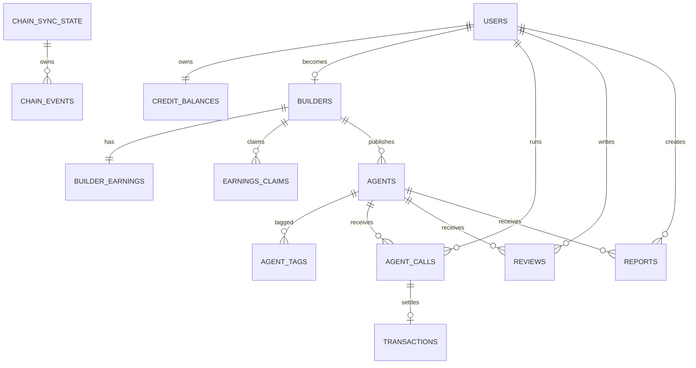

# Database schema

> Last verified against `server/src/db/schema.ts`: 2026-07-15.

Velostra memakai PostgreSQL dan Drizzle ORM. ID application row memakai CUID2.
Money column memakai `numeric(20,6)` dengan Drizzle `mode: number`; keputusan
production tentang arbitrary precision/rounding masih harus difinalisasi.

Crystal V/public asset dan MetaMask/injected picker update tidak menambah schema;
wallet identity tetap dinormalisasi melalui `users.wallet_address`.

## Relationship map



## Tabel

| Table | Tujuan dan constraint penting |
|---|---|
| `users` | Identity wallet; `wallet_address` unique, optional `email` unique. |
| `credit_balances` | Satu row per user; spendable gateway balance dan free-tier fallback. |
| `builders` | Satu profile per user; wallet unique; status dan verification. |
| `builder_earnings` | Satu row per builder; total earned, available, total claimed. |
| `earnings_claims` | Audit claim; `tx_hash` unique, chain/contract/block/log metadata. |
| `agents` | Listing, endpoint, plaintext HMAC secret, price, status, stats. Slug unique. |
| `agent_tags` | Tag per agent; unique `(agent_id, tag)`. |
| `agent_calls` | Durable call intent/output/status, amounts, timing, unique `onchain_call_id`. |
| `transactions` | Ledger TOPUP/AGENT_CALL/etc.; unique `tx_hash`, unique optional `agent_call_id`. |
| `reviews` | Unique `(agent_id, user_id)`. |
| `reports` | Moderation record; user-facing create route belum ada. |
| `platform_stats` | Daily-rollup shape; belum ada job yang mengisi. |
| `chain_sync_state` | Satu cursor per chain + contract; `last_processed_block`. |
| `chain_events` | Raw event ledger; unique `(tx_hash, log_index)`, pending/reconciled state. |

## Enum

- `builder_status`: `ACTIVE`, `SUSPENDED`, `BANNED`;
- `claim_status`: `PENDING`, `PROCESSING`, `COMPLETED`, `FAILED`;
- `agent_status`: `PENDING`, `APPROVED`, `REJECTED`, `SUSPENDED`, `REMOVED`;
- `call_status`: `PENDING`, `PROCESSING`, `SUCCESS`, `FAILED`, `TIMEOUT`;
- `transaction_type`: `TOPUP`, `AGENT_CALL`, `BUILDER_CLAIM`, `REFUND`,
  `PLATFORM_WITHDRAWAL`;
- `tx_status`: `PENDING`, `CONFIRMED`, `FAILED`;
- `chain_event_type`: `DEPOSIT`, `EARNINGS_CREDITED`, `CLAIMED`,
  `PLATFORM_REVENUE_WITHDRAWN`.

Category, price tier, report reason, dan report status juga didefinisikan sebagai
Postgres enum di schema.

## Money-loop records

### `credit_balances`

`balance_usd` adalah spending authority gateway. Deposit menaikkannya; paid call
yang berhasil menurunkannya. Worker boleh menghasilkan balance negatif ketika
chain membuktikan settlement tetapi credit sempat dikonsumsi call lain setelah
failed DB commit; ini mempertahankan debt daripada menyembunyikan undercharge.
Production alert harus menangkap kondisi tersebut.

### `agent_calls`

Paid call intent dibuat `PROCESSING` sebelum external side effect.
`onchain_call_id = keccak256(agent_calls.id)` dan unique. Output upstream disimpan
sebelum settlement broadcast. Final status + financial fields hanya dimiliki oleh
jalur yang memenangkan conditional `PROCESSING -> SUCCESS`.

### `transactions` dan `earnings_claims`

`transactions` menyimpan top-up, paid-call settlement, dan platform withdrawal.
Claims disimpan di `earnings_claims`. Hash unik merupakan database-level replay
defense; route juga melakukan early replay check untuk error yang lebih jelas.

## Chain reconciliation records

### `chain_sync_state`

- `id`: `escrow:<chainId>:<lowercaseAddress>`;
- unique `(chain_id, contract_address)`;
- `last_processed_block` hanya maju dengan `greatest(current, rangeEnd)`.

### `chain_events`

Menyimpan event type, tx hash, log index, block number/timestamp, actor,
correlation ID, primary amount, optional secondary amount, reconciliation flag,
error, dan timestamp. `(tx_hash, log_index)` adalah identity yang benar karena
satu transaction dapat mengemit lebih dari satu log.

Unknown actor/call tetap tersimpan sebagai pending. Ini memungkinkan cursor maju
tanpa kehilangan raw evidence dan worker melakukan retry setelah mapping tersedia.

## Financial safety constraints

- unique wallet/user/builder one-to-one relationships;
- unique transaction and claim hashes;
- unique raw event identity;
- unique paid-call correlation ID;
- maksimum satu transaction link per agent call;
- foreign key pada seluruh core ownership path;
- row locks untuk balance/earnings yang berubah;
- conditional call finalization untuk side-effect ownership.

Unique constraint menjamin idempotency, tetapi tidak menggantikan application
transaction dan invariant monitoring.

## Schema operations

Current development flow:

```bash
cd server
npm run db:push
```

`db:push` hanya cocok untuk disposable/local database. Workspace belum memiliki
versioned migration files. Sebelum production:

1. generate dan review baseline migration;
2. test fresh install dan upgrade path;
3. backup + restore drill;
4. tambahkan index berdasarkan query plan;
5. hentikan direct `db:push` terhadap production;
6. definisikan data retention/soft deletion;
7. encrypt `agents.secret_key`;
8. putuskan populate atau hapus `platform_stats`.

Rencana ini ada di Phase 1 [ROADMAP.md](./ROADMAP.md).
