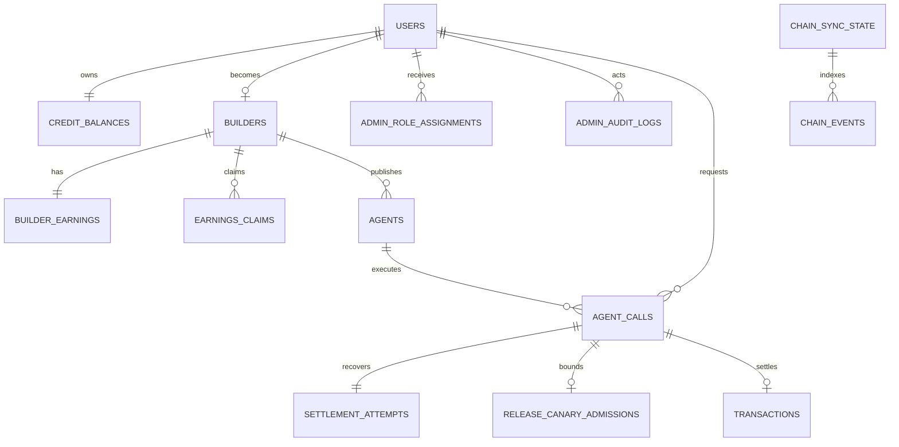

# Database schema and recovery

> Last verified against `server/src/db/schema.ts` and `server/drizzle`: 2026-07-16.
> Phase state: Phase 0-3 repository preparation is complete and has passed internal
> engineering/CI audit; continued development is clear. Managed-staging evidence
> remains a mainnet release prerequisite.

Velostra uses PostgreSQL, Drizzle ORM, CUID2 application IDs, and reviewed versioned
SQL migrations. Financial columns are `numeric(20,6)` exposed to server logic as
canonical decimal strings. Critical decisions convert them to integer minor units;
JS numbers are used only at the JSON presentation boundary.

## Core relationships



## Tables

| Table | Purpose / invariant |
|---|---|
| `users` | unique EVM wallet identity |
| `admin_role_assignments` | granular, revocable DB admin roles; unique user+role |
| `admin_audit_logs` | action, actor, target, request ID, IP, metadata, time |
| `credit_balances` | spendable, reserved, free-tier fallback; one row/user |
| `builders` | one builder/user and wallet; lifecycle status |
| `builder_earnings` | exact earned, available, claimed totals |
| `earnings_claims` | claim evidence; unique tx hash and chain metadata |
| `agents` | listing, encrypted secret envelope, revoke time, price, stats |
| `agent_tags` | unique agent+tag |
| `agent_calls` | durable input/output/status, correlation, exact split |
| `transactions` | top-up/call/platform ledger; unique tx hash/call link |
| `settlement_attempts` | reservation/outbox state and candidate hash |
| `release_canary_admissions` | manifest/policy-bound canary subject, exposure, and terminal status |
| `reviews` | unique agent+user review |
| `reports` | moderation record |
| `platform_stats` | future daily rollup shape |
| `chain_sync_state` | deployment cursor |
| `chain_events` | raw event ledger and retry state |
| `operational_heartbeats` | durable worker/monitor/backup liveness and metadata |
| `operational_alerts` | deduplicated alert lifecycle, acknowledgement, notification, resolution |

There are 20 public application tables.

## Money invariants

Database checks enforce:

```text
balance_usd >= 0
reserved_usd >= 0
reserved_usd <= balance_usd
gross_amount > 0
builder_amount >= 0
platform_amount >= 0
gross_amount = builder_amount + platform_amount
```

Paid-call reservation uses a conditional update on available credit
`balance - reserved`. Finalization requires both balance and reservation to cover
the exact gross. A failed pre-chain call conditionally releases only its own
reservation.

## Settlement attempt states

| State | Meaning |
|---|---|
| `PREPARED` | call, reservation, and outbox committed; builder not complete |
| `READY` | successful builder output is durable; may broadcast |
| `SUBMITTED` | candidate tx hash persisted |
| `AMBIGUOUS` | broadcast or receipt outcome uncertain; keep reservation |
| `CONFIRMED` | receipt success known; ledger not necessarily applied |
| `APPLIED` | call and all financial effects committed |
| `FAILED` | definitive safe failure; reservation released |

`attempt_count` distinguishes initial and recovery broadcasts. A correlated event
can supply the authoritative successful hash if an ambiguous candidate differs.

## Idempotency and race safety

- unique `transactions.tx_hash`;
- unique `earnings_claims.tx_hash`;
- unique `(chain_events.tx_hash, log_index)`;
- unique `agent_calls.onchain_call_id`;
- unique optional `transactions.agent_call_id`;
- one `settlement_attempts` row per call;
- at most one `release_canary_admissions` row per call; concurrent cap checks use a transaction-scoped advisory lock;
- conditional `PROCESSING -> SUCCESS` owns all financial side effects.

## Cursor behavior

`chain_sync_state.id` is `escrow:<chainId>:<address>`. Normal scans advance only
when starting at exactly `last_processed_block + 1`. Retroactive or intentionally
overlapping ranges preserve the cursor, preventing an operator from jumping over
an unscanned gap.

## Migrations

```text
0000_phase0_baseline.sql
0001_security_rbac.sql
0002_settlement_outbox.sql
0003_query_indexes.sql
0004_transaction_indexes.sql
0005_earnings_invariants.sql
0006_dark_darkstar.sql  # operational heartbeats and alerts
0007_phase3_canary_admissions.sql  # bounded rollout admission ledger
```

Use:

```bash
npm --prefix server run db:check
npm --prefix server run db:migrate
npm --prefix server run test:migrations
```

`test:migrations` proves both fresh install and upgrade path, exact balance
preservation, reservation initialization, state enum order, non-negative earnings and
positive-claim and canary constraints, 20
tables, and operational indexes. `db:push` is local prototyping only and must not
be used on persistent staging/production data.

## Operational indexes

Indexes cover marketplace/status/category, builder submissions, user/agent call
history, call status queues, claims, reports, settlement pending work, admin audit,
admin assignments, raw event scan/retry, credit transaction history, and
chain-specific ledger queries.

## Backup and restore

The current disposable drill uses `pg_dump --format=custom`, restores into a clean
database, and runs `npm --prefix server run restore:verify`. Verification compares all
20 tables, eight migrations, every row count, exact financial/outbox aggregates,
constraints, and indexes. With the restore timing environment variables, it writes a
redacted evidence JSON; the measured local full-data drill completed in 1,542 ms.

Production must still prove provider-native encrypted PITR/WAL, retention, access
separation, and managed RPO/RTO. Exact procedure is in
[OPERATIONS.md](./OPERATIONS.md).
