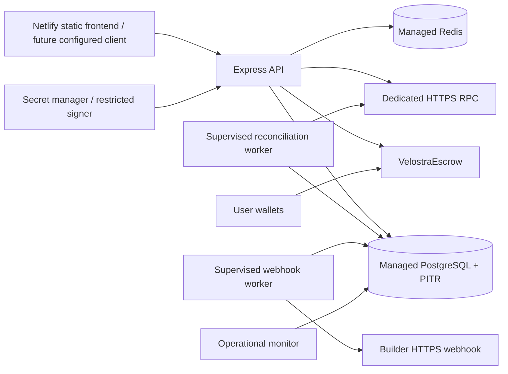

# Deployment and operations

> Last verified against build/deploy scripts and managed staging: 2026-07-19.
> Phase state: Phase 0-4 repository preparation is complete and has passed internal
> engineering/CI audit; continued development is clear. Managed-staging evidence
> remains a mainnet release prerequisite.
> The static public frontend remains at https://velostra.xyz/ and is not connected to
> staging. A separate US-only Robinhood testnet stack now runs the private signer,
> API, isolated web, migration, reconciliation/webhook/monitor jobs, and Scheduler
> triggers against verified testnet Safe authorities and escrow. Deep readiness
> passes and paid writes remain disabled. No closed beta, mainnet deployment, or
> real-value authorization is recorded.

## Release gates

Phase 0-4 repository preparation is complete and has passed internal engineering/CI
audit. This is not deployment authorization. Independent contract/backend review,
the managed-staging evidence packet, an immutable approved release manifest, and an
explicit operator broadcast remain mainnet release gates. Provision only isolated
non-mainnet-value staging, execute the real-wallet/alert/outage/PITR/72-hour drills,
and pass every signed validator. Do not deploy mainnet value until all gates close.

## Current US-only staging target

The authorized non-mainnet target is Robinhood testnet chain 46630. Its executable
policy is [deploy/gcp](../deploy/gcp/README.md):

- GCP Cloud Run, Scheduler, KMS, Secret Manager, and Artifact Registry in us-east4;
- Neon Postgres in aws-us-east-1;
- Upstash Redis Free on GCP us-east4 with no paid read replicas;
- Alchemy Free primary plus Robinhood public testnet fallback RPC;
- scale-to-zero web/API/private-signer services and staggered 15-minute jobs;
- paid writes disabled and a USD 35 cross-provider monthly envelope.

All mutation scripts are plan-only without Apply. They require a clean full release
SHA and immutable image digests. The applied US foundation, managed data plane,
twelve scoped secret values, and direct private-Telegram delivery are verified.
Three disjoint canonical Safe 1.4.1 2-of-3 authorities, a synthetic 6-decimal token,
and VelostraEscrow are deployed and live-verified on chain 46630. Immutable
signer/API/web services, migration, reconciliation/webhook/monitor jobs, and staggered
Scheduler triggers are deployed in us-east4. The isolated web origin is bound, deep
readiness passes, anonymous signer access is rejected, and paid writes remain
disabled. The separate static Netlify preview satisfies no managed staging evidence
gate until an explicit cutover.

## Target topology



Initial production topology has one logical signer writer, one continuous
reconciliation worker, one continuous webhook worker, and one operational monitor.
The low-cost US staging translation keeps the signer at one instance and invokes
reconciliation, webhooks, and monitoring as separate one-task Cloud Run Jobs on
staggered 15-minute schedules. API read traffic may scale only within its bounded
two-instance cap; signer nonce behavior stays isolated.

Current deployment overlay: the static Netlify frontend remains the public preview and
has no staging API/contract build values. The diagram's API and stateful/financial
nodes are live only behind the separate isolated staging web origin. That environment
is testnet-only, readiness-green, and write-disabled.

## Database release

Use reviewed migrations, never `db:push` against persistent data:

```bash
npm ci --prefix server
npm --prefix server run db:check
npm --prefix server run db:migrate
```

Release order is backup, migration, verification, then application rollout. Enable
encrypted PITR/WAL and complete the restore procedure in
[OPERATIONS.md](./OPERATIONS.md).

## Backend role build

```bash
npm --prefix server run build
node server/dist/index.js
node server/dist/jobs/reconcile.js --watch
node server/dist/jobs/webhooks.js --watch
node server/dist/jobs/monitor.js --watch
```

All backend roles run strict role-aware production configuration validation.

## Required production environment

| Variable | Requirement |
|---|---|
| `NODE_ENV` | `production` |
| `DATABASE_URL` | PostgreSQL URL from secret manager |
| `REDIS_URL` | Redis/rediss URL; production mode fails closed |
| `REDIS_FAILURE_MODE` | `closed` or omitted |
| `AUTH_NONCE_STORE` | `redis` or omitted |
| `JWT_SECRET` | non-default, at least 32 characters |
| `AUTH_PUBLIC_URI` | canonical HTTPS frontend origin |
| `WEB_ORIGIN` | comma-separated exact HTTPS origins including auth URI |
| `TRUST_PROXY` | exact edge proxy trust policy |
| `GATEWAY_HMAC_SECRET` | non-default, at least 32 characters |
| `AGENT_SECRET_ENCRYPTION_KEY` | exactly 32 bytes, base64 or 64 hex |
| `AGENT_SECRET_ENCRYPTION_KEY_ID` | stable key ID |
| `AGENT_SECRET_DECRYPTION_KEYS` | optional JSON old-key map during rotation |
| `ADMIN_BOOTSTRAP_WALLETS` | initial governance wallets only |
| `VELOSTRA_ESCROW_ADDRESS` | non-zero deployed escrow |
| `BACKEND_SIGNER_PRIVATE_KEY` | forbidden in production; startup rejects it |
| `SETTLEMENT_SIGNER_MODE` | exactly `remote` |
| `SETTLEMENT_SIGNER_URL` | restricted HTTPS signer endpoint |
| `SETTLEMENT_SIGNER_AUTH_TOKEN` | managed secret, at least 32 characters |
| `SETTLEMENT_SIGNER_ADDRESS` | non-zero authorized settler |
| `ONCHAIN_SETTLEMENT_MODE` | exactly `required` |
| `ROBINHOOD_CHAIN_ID` | 46630 for non-mainnet staging; 4663 only for an approved mainnet-like release |
| `SETTLEMENT_TOKEN_DECIMALS` | `6` |
| `ROBINHOOD_RPC_URL` | dedicated primary HTTPS endpoint |
| `ROBINHOOD_RPC_FALLBACK_URLS` | optional comma-separated credential-free HTTPS fallbacks |
| `VELOSTRA_DEPLOYMENT_BLOCK` | positive exact deployment block |
| `PHASE3_MAINNET_STARTUP_APPROVAL` | exactly `explicitly-approved` for mainnet-like processes |
| `PHASE3_RELEASE_MANIFEST` | mounted deployed manifest path |
| `PHASE3_RELEASE_MANIFEST_SHA256` | exact lowercase canonical manifest hash |
| PHASE3_PAID_WRITES_MODE | disabled initially; canary only after readiness; public only after exit approval |
| PLATFORM_CURSOR_SECRET | separate managed secret, at least 32 characters |
| READINESS_REQUIRE_WEBHOOK_WORKER | true |
| READINESS_WEBHOOK_WORKER_MAX_AGE_MS | bounded heartbeat age, default 90000 |
| WEBHOOK_BATCH_SIZE / WEBHOOK_MAX_ATTEMPTS | bounded worker capacity/retry policy |
| WEBHOOK_RETRY_BASE_MS / WEBHOOK_RETRY_MAX_MS | bounded exponential retry window |
| WEBHOOK_LOCK_MS / WEBHOOK_INTERVAL_MS | bounded ownership lease and poll interval |

Operational tuning is documented in `server/.env.example`: HTTP size/proxy, Redis
timeout, agent egress caps, RPC timeout, reconciliation interval/range/
confirmations/retries/backoff/drift, and outbox grace.

Before traffic, production startup also verifies there are no plaintext agent
secrets and at least one active/bootstrappable super admin.

## Phase 3 preparation and contract deployment

Preparation is safe to run repeatedly and cannot broadcast:

```bash
npm ci
npm ci --prefix contracts
npm run test:phase3
npm run release:prepare
npm run release:validate
npm run release:plan
```

For a real release, replace the preparation input with reviewed image digests,
Phase 2 and independent-review evidence, enabled bounded canary policy, accountable
ticket, and two distinct approvals. Recreate and validate the
`broadcast-approved` manifest from a clean frozen commit.

The contract command is inert without every guard:

```bash
PHASE3_MAINNET_BROADCAST=explicitly-approved PHASE3_RELEASE_MANIFEST=artifacts/phase3/release-manifest.json PHASE3_RELEASE_MANIFEST_SHA256=<canonical-sha256> PHASE3_RELEASE_APPROVAL_TICKET=<approved-ticket> VELOSTRA_RELEASE=<full-commit> npm --prefix contracts run deploy:robinhood -- --broadcast
```

It verifies chain 4663, manifest/ticket/release, deployer, exact constructor, token
decimals, role separation, admin code, and reproducible artifact before sending.
After confirmation:

```bash
npm run release:finalize
npm --prefix contracts run verify:robinhood
```

Store the deployed manifest and verification artifact in the evidence mount. The
verification command checks receipt, runtime code with immutable slots, settlement
token, fee, pause/solvency/successor, and role ownership. Local
`contracts/deployment.json` remains ignored and is never sufficient release evidence.

## Readiness and bounded canary

Keep `PHASE3_PAID_WRITES_MODE=disabled` while collecting the final pre-canary
snapshot:

```bash
npm --prefix server run phase3:snapshot
npm run release:readiness
```

Only a `GO` permits an operator to change mode to `canary`. Supply the exact enabled
policy hash and start timestamp. The API then enforces immutable subjects and
duration/call/wallet/total exposure inside the reservation transaction.

At the end of the bounded window:

```bash
npm --prefix server run phase3:canary-summary
npm run release:canary
```

Any failed check returns `STOP`: disable new paid writes, preserve claims, keep
reconciliation running, page the owner, and forward-repair. A pass returns
`PASS_AWAITING_OPERATOR` and `expansionAuthorized: false`. Public mode additionally
requires the exact passing decision file/hash and
`PHASE3_CANARY_EXIT_APPROVAL=explicitly-approved`.

## Frontend deployment

Current public deployment truth:

- canonical origin: `https://velostra.xyz/`;
- redirect alias: `https://www.velostra.xyz/`;
- provider default: `https://velostra.netlify.app/`;
- Netlify identity: site `velostra`, team `Velostra`, slug `velostralabs`;
- source: `velostralabs/velostra`, branch `main`;
- tracked config: `netlify.toml`, Node.js 22, command `npm run build`, publish `dist`;
- SPA fallback: `public/_redirects` is copied into `dist/`;
- no Netlify Functions and no client-side secret values.

The first Git-linked deployment incorrectly served repository-root `index.html` and
therefore referenced `/src/main.tsx`. Commit `0b686e5` introduced the reproducible
publish contract. The corrected deployment was verified with valid TLS, 200 responses
for hashed JS/CSS assets, and a real-browser render smoke. Future changes must retain
that contract and must never publish the repository root.

```bash
npm ci
npm run lint
npm run build
netlify build --context production
```

Build-time public values:

- `VITE_API_URL`;
- `VITE_ESCROW_ADDRESS`;
- `VITE_SETTLEMENT_TOKEN`.

Those three values are intentionally absent from the current public preview. Add them
only after the US testnet API and verified contract addresses exist. Until then,
API-backed marketplace/auth/dashboard/builder/admin and financial actions are not
operational even though the client routes render.

Serve `dist/` behind TLS/CDN with SPA fallback to `/index.html`, no-cache/short cache
for HTML, immutable cache for hashed assets, CSP appropriate to wallet/RPC/API
origins, and no server secret in `VITE_*`.

## Release sequence

For the Robinhood testnet staging sequence, follow the guarded procedure in
[deploy/gcp/README.md](../deploy/gcp/README.md). It prepares encrypted testnet-only
custody, checks canonical Safe readiness without decrypting keys, deploys and verifies
three 2-of-3 authorities, then deploys and verifies the escrow before building
immutable images. Migration remains explicit, paid writes remain disabled, and the
API is finally rebound to the generated staging web origin. That isolated Cloud Run
surface remains distinct from the public Netlify preview until an explicit,
evidence-backed cutover binds `velostra.xyz` to the managed API.

The mainnet sequence remains gated:

1. freeze audited commit and constructor parameters;
2. backup database and apply migrations;
3. deploy and verify contract;
4. configure API/reconciliation/webhook/monitor roles with scoped secrets;
5. start reconciliation and webhook workers plus monitor; catch up and require zero
   financial/delivery drift;
6. deploy API with write traffic closed;
7. deploy frontend with write actions closed;
8. run read/auth/wallet smoke;
9. enable low-value allowlisted canary;
10. verify deposit, paid call, claim, balances, liabilities, cursor, alerts, and
    recovery; only then expand.

Rollback of API/frontend never reverts chain effects. Keep reconciliation, webhook
delivery, and monitoring active.
Contract incidents use pause, settler revoke/rotation, and successor procedure from
[OPERATIONS.md](./OPERATIONS.md).

## One-hour catch-up

Correctness is safe because failed ranges do not advance the cursor. Default 2,000
block chunks, retry/backoff, adaptive splitting, and ordered multi-RPC failover let the
worker resume a large gap without skipping. The local 27-block drill passed with zero
drift; sustained failure across every provider can still delay recovery. Freeze no
one-hour SLO until the managed-staging outage artifact passes.
