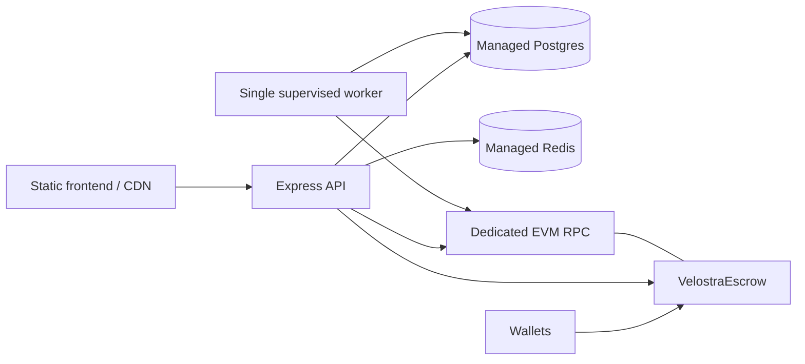

# Deployment dan operasi

> Last verified against build/deploy scripts: 2026-07-15.
>
> Belum ada production/mainnet deployment yang tercatat di workspace ini.

## Target topology



Minimum production unit: static frontend, API service, worker service, Postgres,
Redis, RPC provider, TLS/edge proxy, secret manager, metrics/logging, and alerts.

## Pre-deployment gates

Jangan mulai deployment contract sebelum Phase 1 `ROADMAP.md` selesai. Current
contract mencampur settlement operator, fee admin, dan treasury withdrawal dalam
`onlyOwner`. Memilih multisig membuat backend signer tidak bisa settle; memilih hot
signer memberi hot key treasury authority. Fix role separation harus terjadi
sebelum ABI freeze/audit/deploy.

Selain itu wajib: audited contract, final token/decimals, SSRF hardening, versioned
migrations, secrets management, real MetaMask/injected browser-wallet E2E, staging
soak, dan worker alerts.

## PostgreSQL

Requirement: PostgreSQL 14+.

Current development command:

```bash
cd server
npm run db:push
```

Jangan jalankan `db:push` pada production data. Workspace belum memiliki migration
files; buat baseline dengan Drizzle Kit, review SQL, test fresh/upgrade path, lalu
jalankan migration sebagai explicit release step sebelum app rollout. Enable
backup/PITR dan lakukan restore drill.

## Redis

Gunakan Redis protocol endpoint yang kompatibel dengan `ioredis`. Redis menyimpan
rate limit dan primary free-tier counter. Saat Redis gagal, limiter fail-open dan
free-tier membaca Postgres fallback. Alert Redis tetap wajib karena outage membuka
abuse window.

## Backend API

Build:

```bash
cd server
npm ci
npm run build
node dist/index.js
```

Required/config env:

| Variable | Fungsi |
|---|---|
| `DATABASE_URL` | Postgres connection string. |
| `REDIS_URL` | Redis protocol URL. |
| `JWT_SECRET` | Long random session key dari secret manager. |
| `ADMIN_WALLET` | Current single admin wallet; temporary until RBAC. |
| `WEB_ORIGIN` | Exact frontend origin untuk CORS. |
| `PORT` | Default 8787. |
| `VELOSTRA_ESCROW_ADDRESS` | Active escrow deployment. |
| `BACKEND_SIGNER_PRIVATE_KEY` | Current paid-call signer; secret manager/KMS required. |
| `SETTLEMENT_TOKEN_DECIMALS` | Default 6; harus match token/contract assumption. |
| `ROBINHOOD_RPC_URL` | Dedicated RPC endpoint. |
| `ROBINHOOD_CHAIN_ID` | Default 4663. |
| `ROBINHOOD_RPC_TIMEOUT_MS` | Default 10000. |
| `ONCHAIN_SETTLEMENT_MODE` | Harus `required` di production. |
| `AGENT_TIMEOUT_MS` | Default 30000. |
| `FREE_TIER_CALLS_PER_MONTH` | Default 10. |
| `GATEWAY_HMAC_SECRET` | Reserved callback verifier; current routes belum memakai. |

`GET /health` saat ini hanya process health, bukan deep readiness untuk DB/Redis/RPC.
Tambahkan readiness sebelum rolling production deploy.

## Reconciliation worker

Build backend yang sama sudah menghasilkan `dist/jobs/reconcile.js`. Untuk image
production yang tidak meng-install dev dependency `tsx`, jalankan compiled entry:

```bash
node dist/jobs/reconcile.js --watch
```

One-shot scheduler:

```bash
node dist/jobs/reconcile.js --once
```

Incident scan:

```bash
node dist/jobs/reconcile.js --once --from-block=123456 --to-block=125000
```

Development aliases tetap tersedia sebagai `npm run reconcile` dan
`npm run reconcile:worker`.

Worker env:

| Variable | Default | Fungsi |
|---|---:|---|
| `VELOSTRA_DEPLOYMENT_BLOCK` | `0` | First block contract; wajib di-set production. |
| `RECONCILE_INTERVAL_MS` | `30000` | Delay watch loop. |
| `RECONCILE_MAX_BLOCK_RANGE` | `2000` | Max normal `getLogs` chunk. |
| `RECONCILE_CONFIRMATIONS` | `12` | Safe-head delay. |
| `RECONCILE_RPC_RETRIES` | `3` | Attempts per RPC operation. |
| `RECONCILE_RPC_RETRY_BASE_MS` | `1000` | Exponential backoff base. |
| `RECONCILE_DRIFT_THRESHOLD` | `0.000001` | Absolute money drift warning threshold. |

Run one supervised continuous worker initially. Unique constraints membuat overlap
idempotent, tetapi belum ada distributed lease. Jangan menjalankan manual
`--from-block` jauh di atas cursor normal karena cursor memakai `greatest` dan dapat
melewati intentional gap. Untuk incident range lama, scan exact range setelah
normal cursor sehat.

Alert minimal:

- `DRIFT WARNING`;
- `worker iteration failed` / `fatal`;
- safe-head minus cursor;
- oldest pending event age dan count;
- RPC 429, timeout, retry, range split;
- recovered negative user balance;
- no worker heartbeat;
- signer gas balance/nonce queue.

## Catch-up setelah backend/worker down satu jam

API downtime tidak menghapus event onchain. Worker restart membaca persistent
cursor dan memproses chunk berurutan. Dengan asumsi target block interval 100 ms,
satu jam kira-kira 36.000 blocks atau 18 default chunks. Actual duration tergantung
RPC throttling dan event density.

Worker sudah memiliki timeout, exponential retry, adaptive range split, and cursor
commit setelah range persisted. 429 tidak di-split; watch iteration gagal, menunggu
interval, lalu retry dari cursor sebelumnya. Artinya catch-up aman secara data,
tetapi waktunya tidak dapat dijamin tanpa dedicated RPC dan staging drill.

Production acceptance criteria: one-hour outage simulation catch up sampai safe
head dalam target yang disepakati, drift kembali nol, tidak ada duplicate ledger,
dan alert terkirim. Ini exit gate Phase 2.

## Frontend

```bash
npm ci
npm run build
```

Deploy `dist/` ke static host/CDN. Build-time env:

- `VITE_API_URL`;
- `VITE_ESCROW_ADDRESS`;
- `VITE_SETTLEMENT_TOKEN`.

Wallet provider config tidak membutuhkan WalletConnect project ID. Build membawa
official MetaMask connector untuk extension/mobile dan injected/EIP-6963 discovery
untuk Rainbow, Coinbase, serta wallet browser lain. Dapp metadata memakai origin
frontend dan Crystal V `192px` asset.

Configure SPA fallback semua unknown path ke `/index.html`, sehingga refresh
`/proof`, `/marketplace`, atau `/agents/:slug` tidak 404. Tambahkan immutable cache
untuk hashed assets dan short/no-cache untuk `index.html`. Public Crystal V icons,
`favicon.svg`, dan `site.webmanifest` boleh memakai long cache hanya jika deploy
memiliki cache invalidation/versioning yang jelas.

Frontend smoke sebelum write UI dibuka:

1. seluruh canonical route direct-refresh tanpa 404/overflow/console error;
2. picker menampilkan tepat satu MetaMask dan opsi injected/named provider;
3. connect, rejection, disconnect, dan wrong-chain switch bekerja;
4. favicon/manifest/Crystal V asset resolve dari production origin;
5. top-up/claim confirmation hanya muncul setelah contract/token address benar.

## Contract deployment

Current script:

```bash
cd contracts
npm ci
cp .env.example .env
npm test
npm run deploy:robinhood
```

Inputs: `DEPLOYER_PRIVATE_KEY`, `SETTLEMENT_TOKEN`, optional
`PLATFORM_FEE_BPS`, `OWNER_ADDRESS`, `ROBINHOOD_RPC_URL`. Script hardcodes chain ID
4663 pada provider dan menulis `contracts/deployment.json` setelah deployment.

Deployment irreversible untuk token address. Setelah audited deployment:

1. record address, tx hash, bytecode/source verification, constructor args, block;
2. set backend/frontend addresses dan `VELOSTRA_DEPLOYMENT_BLOCK`;
3. fund only required operational gas;
4. start worker and verify drift zero;
5. smoke test canary amounts sebelum membuka write UI.

## Release order

1. backup DB dan apply reviewed migration;
2. deploy API in read/closed mode;
3. deploy/start worker and observe cursor/drift;
4. deploy frontend assets with write actions still gated;
5. run health, MetaMask/injected wallet, auth, marketplace, top-up, paid-call, reconciliation, dan claim smoke;
6. enable canary users/limits;
7. promote only after ledger/onchain manual reconciliation.

Rollback API/frontend tidak me-rollback chain. Jika confirmed event sudah ada,
worker harus tetap hidup untuk menyelesaikan database state. Contract incident
membutuhkan pause/revoke/migration mechanism yang harus dibangun sebelum launch.
